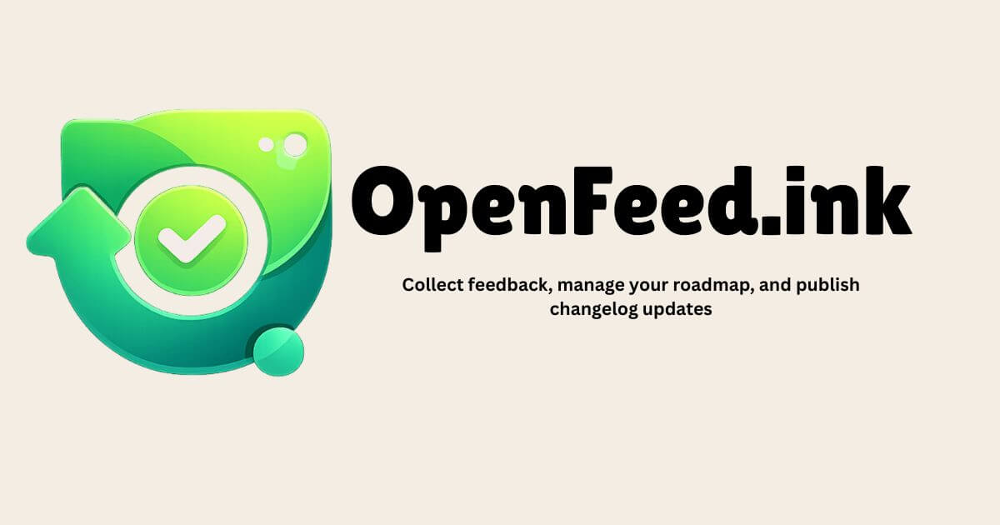

<div align="center">
 

 
# OpenFeed

**The open source alternative to Canny and Frill.**

Feedback boards · Public roadmap · Changelog · AI Product Advisor


[App](https://openfeed.ink)  · [Documentation](https://openfeed.ink/docs)
</div>
 
OpenFeed lets your users submit feedback, follow your roadmap, and see what you've shipped — all inside your app through one embeddable widget.
 
You install it once. Everything else is managed from your dashboard.

---
 
## Install

```bash
npm install @openfeed-ink/widget
# or
pnpm add @openfeed-ink/widget
# or
yarn add @openfeed-ink/widget
```

**Prefer a script tag?**
```html
<script async src="https://cdn.openfeed.ink/widget/v1/widget.iife.js" data-project-id="your-project-id"></script>
```

---

## Usage

### React

```tsx
import { OpenFeed } from '@openfeed-ink/widget'

export default function App() {
  return (
    <>
      <YourApp />
      <OpenFeed projectId="your-project-id" />
    </>
  )
}
```

### Next.js

```tsx
// app/layout.tsx
import { OpenFeed } from '@openfeed-ink/widget'

export default function RootLayout({ children }) {
  return (
    <html>
      <body>
        {children}
        <OpenFeed projectId="your-project-id" />
      </body>
    </html>
  )
}
```

### Plain HTML / Any framework

```html
<script
  async
  src="https://cdn.openfeed.ink/widget/v1/widget.iife.js"
  data-project-id="your-project-id">
</script>
```
 
One line. The widget loads, fetches your configuration, and renders inside a Shadow DOM so it never conflicts with your app's styles.
 
---
 
## Features
 
**Feedback Board**
Users submit feature requests and upvote existing ones. AI detects semantic duplicates before submission using pgvector — your board stays clean without manual effort. Anonymous users supported via secure cookies.
 
**Public Roadmap**
Drag-and-drop kanban board with Planned / In Progress / Done columns. Your users see what's coming. Your team manages it from the dashboard.
 
**Changelog**
Write updates with a rich text editor. Categorize as new feature, improvement, or bug fix. A notification dot appears on the widget when new entries are published.
 
**Announcements**
Show banners inside your app without touching your codebase. Control position, colors, dismiss behavior, and action button — all from the dashboard.
 
**Widget Builder**
Configure everything visually — colors, theme, button style, position, which tabs are visible. A live preview updates as you change settings. No code changes ever needed after install.
 
**AI Product Advisor**
An agentic AI that queries your actual feedback data to answer product questions. Ask "what should I build next?" — it checks your top requested features, reviews your roadmap, digs into specific posts, then gives a specific reasoned answer. Not a generic chatbot. It uses your data.
 
**Team**
Invite teammates by email. Two roles: Admin (full access) and Member (manage feedback, no billing or settings access).
 
**Analytics**
Widget open counts, upvote trends over time, and top requested features — all visualized in your dashboard.
 
---
 
## Widget Customization
 
Everything configured from the dashboard, applied instantly — no redeployment needed.
 
```ts
{
  theme: "dark" | "light" | "system",
  triggerBtn: {
    position: "float-bottom-right" | "float-bottom-left" | "drawer-left" | "drawer-right",
    color: string,
    size: "default" | "sm" | "lg" | "icon",
    text: string | null,
    icon: string | null,
  },
  showFeedback: boolean,
  showRoadmap: boolean,
  showChangelog: boolean,
  announcement: {
    position: "top" | "bottom",
    text: string,
    bgcolor: string,
    textcolor: string,
    dismiss: boolean,
  }
}
```
 
---
 
## Self-hosting
 
```bash
git clone https://github.com/yourusername/openfeed
cd openfeed
cp .env.production.example .env
./scripts/setup.sh
```
 
Running at `http://localhost:3000`. Full guide → [docs.openfeed.ink/self-hosting](https://openfeed.ink/docs/self-hosting)
 
---
 
## Stack
 
Next.js 15 · PostgreSQL · Drizzle ORM · Better Auth · Tailwind · shadcn/ui · Vite · OpenAI  · Docker
 
---
 
## Contributing
 
```bash
git clone https://github.com/OpenFeed-ink/openfeed
cd openfeed
cp .env.example .env
pnpm install && pnpm dev
```
 
Issues and PRs welcome — see [CONTRIBUTING.md](./CONTRIBUTING.md).
 
---
 
<div align="center">
<sub>If OpenFeed is useful to you, a ⭐ goes a long way.</sub>
</div>
 
